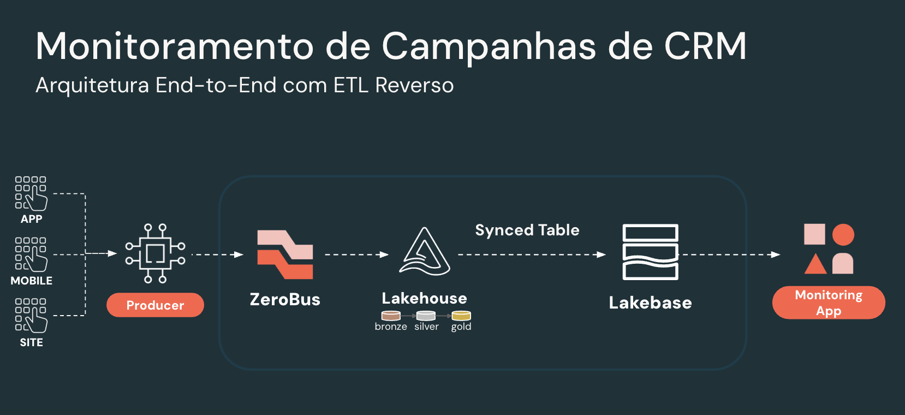

# CRM WebAnalytics Ingest

Pipeline de dados real-time para monitoramento de campanhas CRM em mobile banking, construído sobre Databricks com arquitetura Medallion (Bronze → Silver → Gold), Lakebase PostgreSQL e dashboard interativo.



## Arquitetura

```
Mobile App → ZeroBus REST API → Bronze (Delta) → DLT (Silver/Gold) → Synced Tables → Lakebase (PostgreSQL) → Databricks App (FastAPI + React)
```

| Camada | Tecnologia | Descrição |
|--------|-----------|-----------|
| **Ingestão** | ZeroBus REST API | 100 records/sec de eventos sintéticos (clicks, impressions, conversions) |
| **Bronze** | Delta Tables | Dados brutos: clicks, campanhas, sessões |
| **Silver** | DLT Streaming | Dados tipados, deduplicados, enriquecidos (hora, dia, business hours) |
| **Gold** | DLT Streaming + CDF | Agregações: performance por campanha, canal, segmento, geo, A/B test, hora, minuto |
| **Lakebase** | Synced Tables (CONTINUOUS) | Replica Gold para PostgreSQL em tempo real |
| **App** | FastAPI + React + Recharts | Dashboard interativo com refresh de 1s |

## Pré-requisitos

- [Databricks CLI](https://docs.databricks.com/dev-tools/cli/install.html) >= 0.200
- [Node.js](https://nodejs.org/) >= 18 (para build do frontend)
- Databricks workspace com:
  - Unity Catalog habilitado
  - Lakebase habilitado
  - ZeroBus REST API habilitado
  - Service Principal configurado

## Setup

### 1. Clone e configure o workspace

```bash
git clone https://github.com/tharsismn/databricks-crm-webanalytics.git
cd databricks-crm-webanalytics
```

Edite `databricks.yml` e defina:

```yaml
workspace:
  host: https://<YOUR_WORKSPACE>.cloud.databricks.com
```

### 2. Configure as variáveis

Edite os defaults em `databricks.yml` ou passe como parâmetros no deploy:

| Variável | Descrição | Exemplo |
|----------|-----------|---------|
| `catalog` | Catálogo Unity Catalog | `main` |
| `schema` | Schema único para todas as tabelas (Bronze, Silver, Gold) | `crm_webanalytics` |
| `lakebase_catalog` | Catálogo UC que federa o Lakebase | `crm_app_lakebase` |
| `workspace_url` | URL completa do workspace | `https://my-ws.cloud.databricks.com` |
| `workspace_id` | ID numérico do workspace | `1234567890` |
| `cloud_region` | Região cloud (AWS/Azure/GCP) | `us-west-2` |
| `secrets_scope` | Scope de secrets com credenciais | `crm-zerobus-sp` |

### 3. Configure os Secrets

Crie um scope de secrets e armazene as credenciais:

```bash
# Criar scope
databricks secrets create-scope crm-zerobus-sp

# Service Principal - Client ID e Secret
databricks secrets put-secret crm-zerobus-sp client-id --string-value "<SP_CLIENT_ID>"
databricks secrets put-secret crm-zerobus-sp client-secret --string-value "<SP_CLIENT_SECRET>"

# Senha do Lakebase (usada pelo Databricks App)
databricks secrets put-secret crm-zerobus-sp lakebase-password --string-value "<LAKEBASE_PASSWORD>"
```

> **Secrets necessários:**
> | Key | Descrição |
> |-----|-----------|
> | `client-id` | Application (Client) ID do Service Principal |
> | `client-secret` | Secret do Service Principal |
> | `lakebase-password` | Senha do role PostgreSQL no Lakebase |

### 4. Configure o Lakebase

Antes de rodar, você precisa de uma instância Lakebase com um database e role configurados:

1. Crie uma instância Lakebase no workspace
2. Crie o database `crm_app`
3. Crie um role (ex: `role_crm_app`) com senha
4. Conceda as permissões necessárias ao role:

```sql
-- Conecte no Lakebase PostgreSQL e execute:
GRANT USAGE ON SCHEMA crm_app TO role_crm_app;
GRANT SELECT ON ALL TABLES IN SCHEMA crm_app TO role_crm_app;
ALTER DEFAULT PRIVILEGES IN SCHEMA crm_app GRANT SELECT ON TABLES TO role_crm_app;
```

> **Nota:** O `ALTER DEFAULT PRIVILEGES` garante que novas synced tables criadas automaticamente já terão permissão de leitura para o role.

5. Anote o host do endpoint (ex: `ep-xxx.database.us-west-2.cloud.databricks.com`)

Edite `app/app.yaml` com os dados da sua instância:

```yaml
env:
  - name: LAKEBASE_HOST
    value: "<YOUR_LAKEBASE_HOST>.database.<REGION>.cloud.databricks.com"
  - name: LAKEBASE_DB
    value: "crm_app"
  - name: LAKEBASE_USER
    value: "<YOUR_LAKEBASE_ROLE>"
  - name: LAKEBASE_PASSWORD
    valueFrom: lakebase-password-secret
```

### 5. Build do Frontend

```bash
cd app/frontend
npm install
npm run build
cd ../..
```

### 6. Deploy

```bash
# Deploy dos jobs + pipeline DLT
databricks bundle deploy -t dev

# Crie o Databricks App (primeira vez)
databricks apps create crm-campaign-monitor

# Deploy do app
databricks apps deploy crm-campaign-monitor \
  --source-code-path /Workspace/Users/<your-email>/.bundle/crm-webanalytics-ingest/dev/files/app
```

## Execução

### Setup automatizado (recomendado)

Use o script `setup.sh` para executar todo o pipeline de uma vez:

```bash
./setup.sh \
  --workspace-url "https://my-workspace.cloud.databricks.com" \
  --workspace-id "1234567890" \
  --cloud-region "us-west-2" \
  --catalog "main" \
  --schema "crm_webanalytics" \
  --secrets-scope "crm-zerobus-sp" \
  --lakebase-catalog "crm_app_lakebase" \
  --profile "DEFAULT"
```

O script executa automaticamente:
1. Build do frontend
2. Bundle deploy
3. Job de ingestão Bronze (aguarda setup_tables terminar)
4. Pipeline DLT com full refresh + modo contínuo (aguarda processar dados)
5. Job de synced tables (aguarda conclusão)
6. Deploy do Databricks App

Flags opcionais:
- `--skip-build` — pular build do frontend (se já foi feito)
- `--skip-deploy` — pular bundle deploy (usar deploy existente)
- `--target` — bundle target: dev/staging/prod (default: dev)

### Sequência manual

1. **Ingestão Bronze** — Execute o job `CRM WebAnalytics - Bronze Setup + ZeroBus Ingest`
   ```bash
   databricks jobs run-now <BRONZE_JOB_ID>
   ```
   Isso cria as tabelas Bronze e inicia a geração contínua de eventos (~100 rps).

2. **Pipeline DLT (Silver + Gold)** — Após a ingestão começar, ative o pipeline DLT em modo contínuo.

   > **Nota:** O bundle deploy cria o pipeline em `development: true`. Para modo contínuo real-time, use a API para configurar:
   ```bash
   # Obter pipeline ID
   databricks pipelines list-pipelines | grep "Medallion"

   # Configurar continuous + production via API
   databricks api get /api/2.0/pipelines/<PIPELINE_ID> > /tmp/pipeline.json
   # Edite o JSON: "continuous": true, "development": false
   databricks api put /api/2.0/pipelines/<PIPELINE_ID> --json @/tmp/pipeline.json

   # Disparar com full refresh (primeira execução)
   databricks api post /api/2.0/pipelines/<PIPELINE_ID>/updates --json '{"full_refresh": true}'
   ```

3. **Synced Tables (Gold → Lakebase)** — Após o DLT processar dados:
   ```bash
   databricks jobs run-now <SYNC_JOB_ID>
   ```

4. **App** — O dashboard atualiza automaticamente a cada 1 segundo.

### Re-execução (gerar novos dados)

Se precisar recriar os dados do zero:

1. Execute o job de ingestão Bronze (vai dropar e recriar as tabelas)
2. Aguarde a ingestão começar a produzir dados
3. Dispare um **full refresh** no pipeline DLT (necessário porque as tabelas Bronze são recriadas com novos IDs):
   ```bash
   databricks api post /api/2.0/pipelines/<PIPELINE_ID>/updates --json '{"full_refresh": true}'
   ```

## Estrutura do Projeto

```
databricks-crm-webanalytics/
├── setup.sh                                # Script de setup e execução automatizado
├── databricks.yml                          # Configuração do Databricks Asset Bundle
├── resources/
│   ├── jobs.yml                            # Jobs: ingestão Bronze + synced tables
│   └── pipelines.yml                       # Pipeline DLT (Silver + Gold)
├── src/
│   ├── ingestion/
│   │   ├── setup_bronze_tables.py          # Cria tabelas Delta Bronze
│   │   └── zerobus_producer.py             # Producer ZeroBus REST API
│   ├── transformations/
│   │   ├── silver_transforms.py            # DLT Silver: limpeza e enriquecimento
│   │   └── gold_transforms.py              # DLT Gold: agregações e KPIs
│   ├── synced_tables/
│   │   └── create_synced_tables.py         # Cria synced tables Gold → Lakebase
│   └── generators/
│       └── generate_crm_events.py          # Gerador alternativo (Spark direto)
├── docs/
│   └── monitor_crm_arch.png               # Diagrama de arquitetura
└── app/                                    # Databricks App
    ├── app.yaml                            # Configuração do app (env vars)
    ├── app.py                              # FastAPI backend
    ├── requirements.txt
    ├── server/
    │   ├── db.py                           # Pool asyncpg (Lakebase)
    │   └── routes/
    │       ├── health.py                   # Health check
    │       ├── kpis.py                     # KPIs, canais, segmentos, geo, A/B test
    │       └── campaigns.py                # Campanhas, trend, search, compare
    └── frontend/                           # React + Vite + Tailwind + Recharts
        ├── package.json
        ├── vite.config.ts
        └── src/
            ├── App.tsx                     # Dashboard principal com cross-filtering
            └── components/                 # KPICards, ClickTrendChart, TopCampaignsTable,
                                            # ChannelPerformance, SegmentBreakdown,
                                            # ABTestResults, GeoPerformance,
                                            # CampaignSearch, CampaignComparator, HourDetail
```

## Features do Dashboard

- **Real-time** — Refresh a cada 1 segundo com dados fluindo do pipeline
- **KPI Cards** — Animação de contagem com indicador LIVE piscante
- **Gráfico de Tendência** — Alternância entre visão por hora (48h) e por minuto (1h)
- **Cross-filtering** — Clique em campanha, canal ou segmento para filtrar todo o dashboard
- **Busca** — Autocomplete de campanhas por nome, canal ou categoria
- **Drill-down** — Clique em um ponto do gráfico para ver detalhes do horário
- **Comparador** — Selecione 2 campanhas para comparação side-by-side de métricas

## Tabelas

Todas as tabelas residem no mesmo schema (`catalog.schema`):

### Bronze (ingestão via ZeroBus)
| Tabela | Descrição |
|--------|-----------|
| `bronze_crm_campaign_clicks` | Eventos brutos de clicks/impressions/conversions |
| `bronze_crm_campaigns_metadata` | Metadados das campanhas CRM |
| `bronze_app_sessions` | Sessões do mobile banking app |

### Silver (DLT - limpeza e enriquecimento)
| Tabela | Descrição |
|--------|-----------|
| `silver_crm_campaign_clicks` | Clicks tipados, deduplicados, com hora/dia/business hours |
| `silver_crm_campaigns` | Campanhas com is_expired, duration_days |
| `silver_app_sessions` | Sessões com duração e nível de engajamento |

### Gold (DLT - agregações com CDF)
| Tabela | Granularidade |
|--------|---------------|
| `gold_campaign_performance` | campaign_id |
| `gold_campaign_hourly_metrics` | campaign_id, data, hora |
| `gold_campaign_minute_metrics` | campaign_id, data, hora, minuto |
| `gold_channel_performance` | campaign_channel |
| `gold_segment_analysis` | target_segment |
| `gold_geo_performance` | região, cidade |
| `gold_ab_test_results` | ab_test_group |
| `gold_daily_kpis` | event_date |

## Licença

MIT
